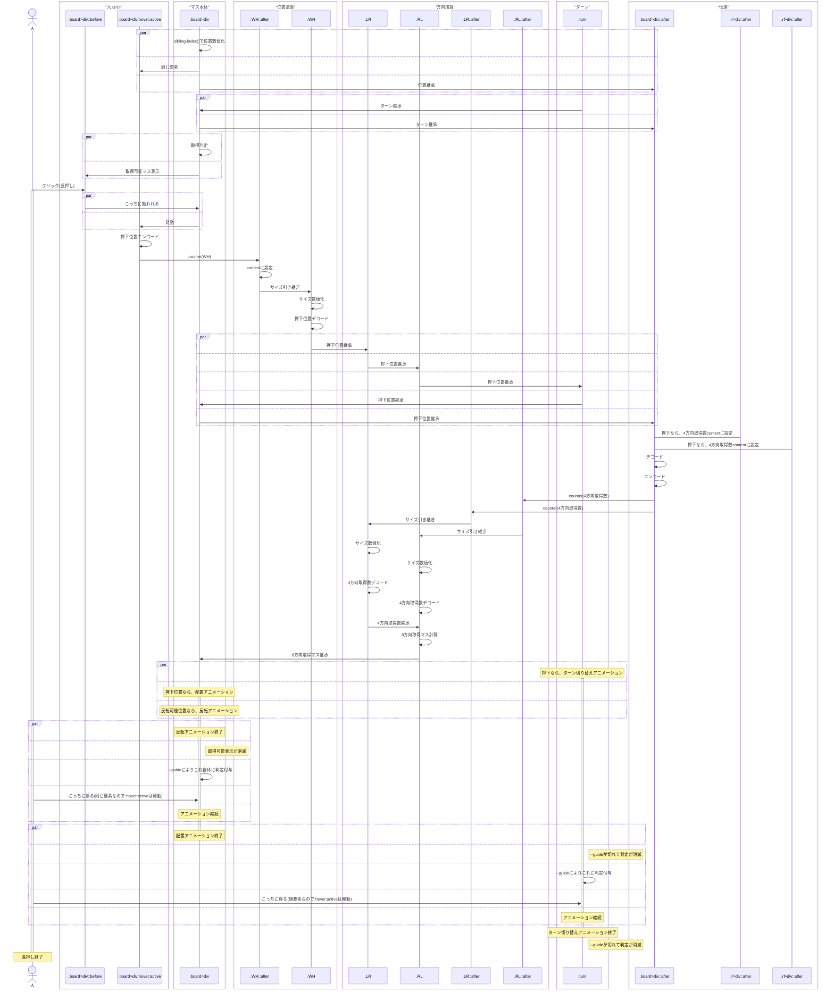

# リバーシ
HTMLとCSSで作ったリバーシです。

## 実際に遊べるページ
https://surahotoke.github.io/Reversi

## プレイ動画
https://github.com/user-attachments/assets/91beee54-63ae-4b89-8c7b-b9d4c8716346

## 遊び方
「置ける」の部分を長押しすると駒を置けます。  
（駒が置かれても、指を離さずターンが切り替わるまで押し続けてください）

## 対応ブラウザ・注意点
- 最新のChromeブラウザを推奨しています。Chrome / Edge / Operaで動作することを確認しました。（Firefox, Safariでは動作しませんでした）
- なるべく対策はしましたが不安定で、後半はだいぶ変な挙動になるかもしれません。
  - 使用するPCによっても安定性が変わってくるようです。
- 稀に処理落ちにより、`エラー コード: 5`が表示されることがあります。再読み込みで解消します。

## 解説記事
Zenn にて仕組みの詳細を書いています  
https://zenn.dev/jigjp_engineer/articles/c1cc55635c6039

## 構成ファイル
- `index.html`（43行）
- `style.css`（98行）
- `script.css`（494行 / うちアットルール242行）

## 仕組み
デカくなっちゃったので見たかったら、拡大してみてね！

## 起きた奇跡
`script.css`のコメント行を全て削除してコードのみにすると、アットルール以外の部分が`222行`、アットルール部分が`222行`となり、完璧な`1:1`の比率で合計が`444行`になります。

正規表現モードで`\n\s*/\* .* \*/`を空文字に置換することで確認できます。

## 更新履歴
- 2026/01/05：判定処理の単純化（52行削減）
- 2025/12/27：斜め方向の判定にあったバグを修正
- 2025/12/22：初コミット